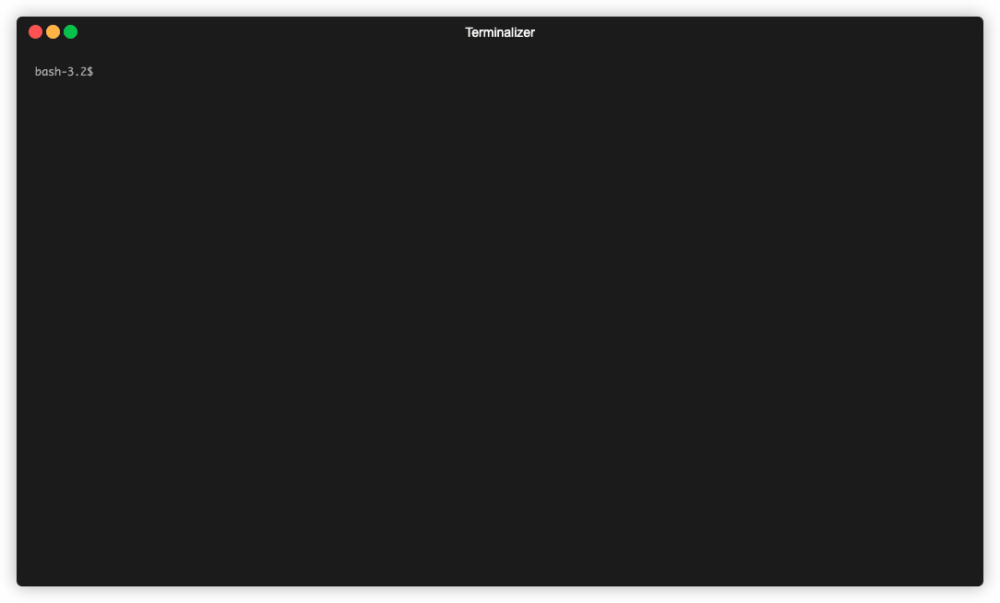

# binder

Execute commands from STDIN, and show logs of those.



## Usage

### Basic

`binder` execute commands passed from STDIN, and show logs of those.
Commands must be separated by line feed.

```sh
$ cat commands
docker logs -f app
docker logs -f db

# Execute commands & show logs
$ cat commands | binder
docker logs -f app| log line of app
 docker logs -f db| log line of db
```

### Specify prefix

`binder` use command itself as prefix.
But you can specify the prefix optionally.
Use the following format to specify the prefix.

```
{prefix}: {command}
```

### See all Docker containers log

```sh
$ docker ps --format '{{.Names}}' | xargs -I {} echo {} ":docker logs --tail=0 -f" {} | binder
```

## Install

### Binary

Go to [release page](https://github.com/sachaos/binder/releases) and download.

or

```shell
$ wget https://github.com/sachaos/binder/releases/download/v0.0.2/binder_darwin_amd64 -O /usr/local/bin/binder
$ chmod +x /usr/local/bin/binder
```

### Manually Build

You need Go 1.13 compiler.

```shell
$ git clone https://github.com/sachaos/binder.git
$ make install
```
